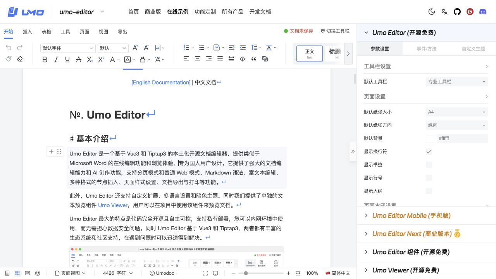
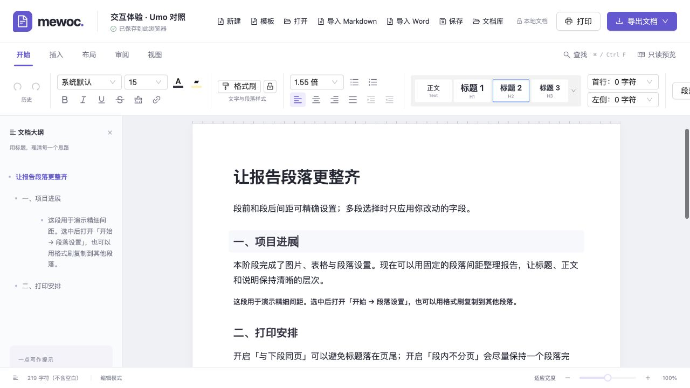
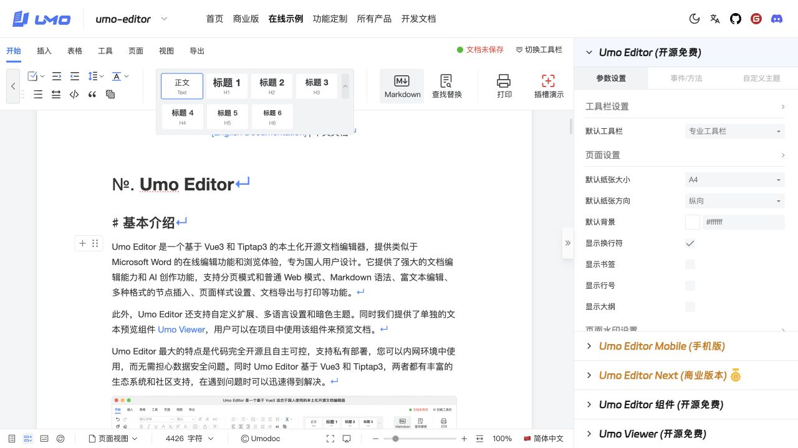
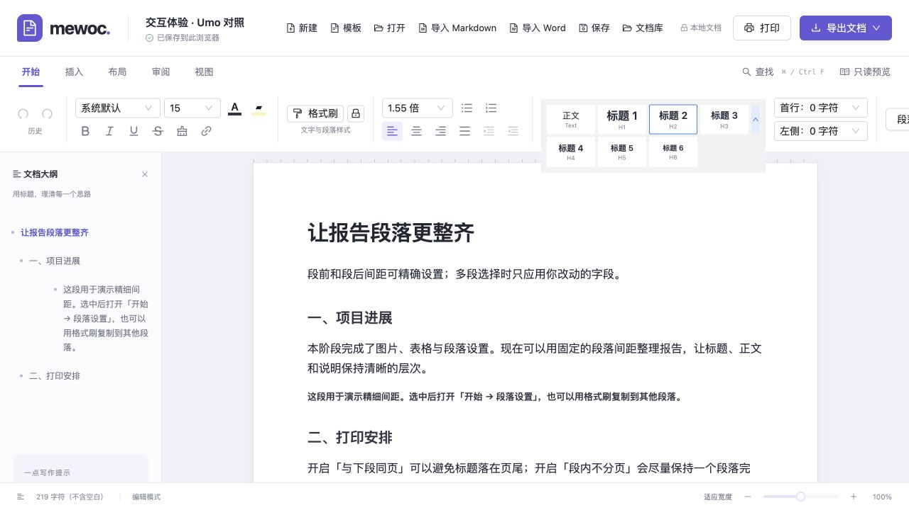

# M13 · 样式选择与段落聚焦交互

日期：2026-10-02。用户指定交互参考：[Umo 在线演示](https://www.umodoc.com/demo)。本轮先在内置浏览器访问真实页面，观察并保存截图，再实现样式卡片、聚焦背景及文字选区反馈；后续交互继续以该演示为参考。

## 对照步骤

1. **点击正文，确认正在编辑的位置。** Umo 对当前段落添加浅色背景，正文失焦后移除。实际计算样式为 `rgb(245,248,252)`、上下外扩 5 px、左右外扩 8 px、圆角 3 px。Mewoc 对正文/标题的文字选区锚点添加相同反馈；跨段只标记一个锚点段落。只读、代码、节点选择和单元格选择不叠加该段落背景。状态：已实现并验证。
2. **选择段落样式。** Umo 使用正文/H1/H2/H3 预览卡片，展开后显示 H4/H5/H6；每卡 68×42 px，当前项为 `#3480f9` 边框，字体预览有大小和字重差异。Mewoc 替换原文字下拉并实现相同卡片层次；展开按钮获得焦点时正文浅底消失，应用后收起并回到原选区。混合样式没有假选中项。状态：已实现并验证。
3. **选中文字并继续编辑。** Umo 的文字选区背景计算值为 `rgb(148,207,255)`，前景继承。Mewoc 使用该色值，并支持卡片方向键、Home/End、Enter/Space 和 Esc；操作保留原文字、手工字体格式、段落精细属性、批注和文档结构。状态：浏览器状态链及完整页面键盘操作已验证。

卡片操作不依赖文字拖选后的临时 DOM 选区。打开前捕获原段落身份与书签，主事务和追加事务完整映射；删除、替换原目标后拒绝旧操作，避免误改新段落。一次应用可独立撤销。列表首段的 schema 要求正文，不能转标题时明确提示且整批不部分应用；报错不会锁住下一次对其他正文的修改。

展开行挂载为独立浮层，避免被横向工具栏滚动区域裁切；位置跟随滚动和窗口变化。保留可辨识的键盘焦点环、按钮名称及 `aria-pressed`/`aria-expanded`。灰色背景对不支持 `color-mix` 的浏览器提供回退。工具栏字号、行距和缩进宽度保留完整回显，较窄空间继续沿用横向滚动。

## 参考与实现截图

参考页聚焦段落：

Mewoc 聚焦标题及卡片选中反馈：

参考页展开样式：

Mewoc 展开样式：

上述截图均来自本轮真实页面并已检查；使用相同 1280×720 浏览器视口进行并排核对。Mewoc 保留既有品牌、文档区域、工具分组和 H1–H3 正文排版，没有将整个 Umo 页面重建。本批未加入块级拖动菜单、浮动选区菜单、自动分页等其他 Umo 功能。

## 文档模型与导出

支持的标题级别从 1–3 扩为 1–6。新增 H4/H5/H6 默认字号 15/14/13 px，字重 600、行高 1.55；对应精确 pt 值进入字号白名单，确保格式刷固化默认外观后仍可校验和保存。原 H1–H3 默认外观不变。

Mewoc 文件、HTML、内部复制粘贴、Markdown 和 DOCX 导出保留六级标题。Markdown 和 Word 导入不再将 H4–H6 压为 H3；Word H7–H9 降至 H6 并展示准确说明。DOCX 的 H4–H6 使用 SDK 默认样式入口覆盖，避免重复样式 ID；Word 字号以半磅保存，不能精确表达的值沿用现有转换提示。大纲按真实级别显示。

聚焦是 ProseMirror Decoration，颜色规则只由 PaperCanvas 引用且受屏幕介质和可编辑容器限制，不是正文属性。不会写入 revision、撤销、JSON、静态 HTML 或打印；空文档的占位提示另用 `::after`，不与背景占用同一个伪元素。

## 验证

Node 24.13.1 全量 **378/378**，新增 31 项：焦点装饰 8、样式事务与键盘路径 12、六级标题通路 11。ESLint 零警告、生产构建、`git diff --check` 通过。npm 仍提示不识别项目 pnpm 配置键，不影响结果。

内置浏览器 **138/138**：新交互 9、原编辑 62、段落精细 9、图表精细 10、文档库 8、历史 11、批注 8、模板 10、Word 导出 5、Word 导入 6。使用真实 Provider、完整工具栏、IndexedDB 和导出链验证焦点、空白占位、混合范围、键盘、只读、结构拒绝后的继续操作、独立撤销、H6 保存以及无交互装饰的静态 HTML。

初次新专项 8/9：fixture 以代码块结束，StarterKit 在首个事务自动补尾段，导致“焦点不改变 revision”的测试基线不合法。修正 fixture 加入正常尾段后，保留原强断言重跑为 9/9，未放宽正文/保存断言。开发阶段热更新和异步模块编译曾让部分测试页回到等待状态；最终在代码稳定后保存完整通过结果。

隔离端口 4182 的完整页面补验：鼠标点击段落显示浅底；展开卡片移除浅底；键盘 End 定位 H6、Enter 应用后正文恢复焦点；保存刷新仍为 H6，初始失焦不带背景。手动页面控制台错误列表为空；开发服务另记录两次 ResizeObserver 未投递通知，未定位到具体测试且未导致断言失败，此处不宣称全部测试页均无控制台通知。最后仅调整字号/行距/缩进控件宽度避免省略，重新构建并检查最终截图；该样式调整之后没有声称重跑全部逻辑测试。

本轮未进行屏幕阅读器全流程、真实输入法、Safari/Chrome 原生鼠标拖选、实际 PDF 或 Word/WPS 原生渲染复核；DOM 状态和截图不构成全平台可访问性或像素完全相同的证明。所有测试在隔离访问源运行，只按本轮 fixture ID 清理，4177 的用户文档未编辑。

证据：[汇总](m13-editor-interaction-evidence/checks.json)、[Node](m13-editor-interaction-evidence/node-tests.txt)、[交互专项](m13-editor-interaction-evidence/interaction-browser.json)、[基础回归](m13-editor-interaction-evidence/base-browser.json)。其他专项 JSON、参考截图和完整页面截图位于同一证据目录。

实现入口：[样式选择器](../src/pages/editor/components/ParagraphStylePicker.jsx)、[样式事务](../src/pages/editor/tools/paragraph-style.js)、[聚焦扩展](../src/pages/editor/extensions/editor-focus.js)、[编辑专用样式](../src/pages/editor/sass/editor-interaction.scss)、[浏览器专项](../tests/editor-interaction-checks.jsx)。
