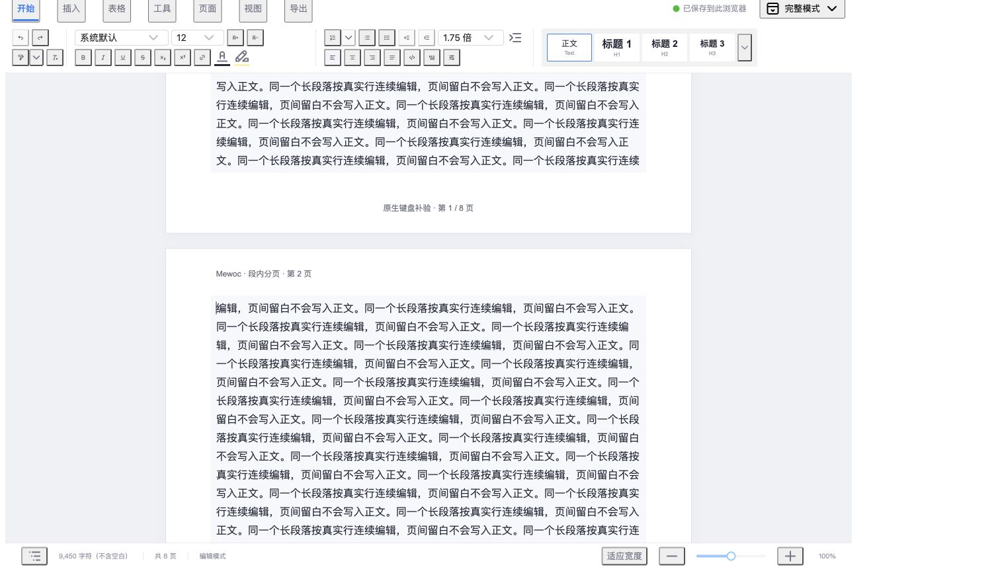

# M25 自动分页 · 第三批：顶层段落与标题按行延续

本批在[多页编辑视图](m25-pagination.md)与[跨页表格](m25-table-pagination.md)上接入顶层段落和标题的段内分页。一个长段落可以延续到多张编辑纸面，原始文档仍只有一个段落；真实标题也保持原层级与一份正文。本批能力与验收结果记录如下，长列表和嵌套容器已在[第四批](m25-container-pagination.md)接入，M25 整体仍待持续验收收口。

## 范围

顶层 `paragraph` 与 `heading`（h1–h6）依据浏览器真实换行位置分页，续页从下一条原始文字行开始。纸型、方向、四边边距、字号、行距、段前后距和缩进改变后重新测量；显示缩放与适应宽度仍使用未缩放的纸面坐标。

默认长段落按行延续。显式 `keepTogether: true` 保留整段同页语义：内容超过标准正文区时完整展开一张加高编辑纸面，后续普通内容恢复标准纸高。展开页继续标明超高内容，不能称为一张物理打印页。

本批只切顶层普通横向文本与 hardBreak 的段落、标题。含内联原子节点、RTL 或无法可靠还原视觉行的段落保留完整块。列表、引用、代码、文本框、折叠详情和单元格内的段落继续随原有完整块或表格安全行组排版，不在嵌套结构里猜测断点。跨页表格和连续表头规则沿用第二批。

## 视图与数据

原始 EditorView、段落、标题、文本标记与 UTF16 位置保持一份。段内断点使用不可编辑的 `span[data-mewoc-paragraph-pagination][data-mewoc-page-gap]` 视图装饰，正文 schema 不新增分页节点、空白段落或硬换行。装饰隐藏于辅助技术，不进入文字选择、字符统计和导航身份。

布局断点携带原始 `paragraphPos` 与 `paragraphLine`，规划器的段落、标题 placement 按真实行安排。测量时扣除当前段内空隙，再按浏览器真实字形和行高计算自然流；不能把包含跨页间隙的整个段落矩形当作一条正文块。

段前距与段后距只用于原段首尾，续页不重置原来的 `firstLineIndent`。段落左缩进与文字对齐保持原样，续页首行以原段普通行的左侧位置继续。零上下边距、大字号与较小纸间距需要保留浏览器可实现的最小装饰高度，允许续页留下少量正文空白，避免负高度校准或持续重排。极大行高使新增留白超出正文预算时完整展开该页，后续恢复标准纸高；同页链因此失效时计入约束退化。当前段落焦点背景也按页面裁剪，页脚和纸间隙不会被长段落背景涂满。

分页事务只更新会话布局，不增加正文修订和撤销步骤。组合输入期间映射已有装饰，候选结束后测量最终文字；关闭分页移除全部段内装饰，重新开启按当前实际排版恢复。只读继续显示同样的纸面和原始正文。

## 编辑、保存与导出

跨页选区、复制、插入、删除和真实分段继续使用原始模型位置。用户按 Enter 产生真实段落属于正文编辑，自动换页不会产生额外段落；撤销只恢复实际正文操作。

本地保存、Mewoc 备份、历史和模板仍保留原始 JSON 与资源。重新打开后重新测量当前浏览器布局，不持久化某次段内断点。HTML、TXT 和 Word 从固定文档快照导出，整段文字只出现一次，屏幕断点不转为硬换行或物理分页符。

编辑纸面、浏览器打印和 Word 各自排版，三者页数可能不同。段内屏幕分页不表示原 DOCX 版式完全还原，也不改变已有手动分页符的文件语义。

## 实现与验收入口

- `tools/page-pagination.js`：段落行边界、首尾段距、完整展开块和逐页小数校准。
- `tools/paragraph-pagination.js`：普通横向文本与 hardBreak 的原始 Range 行测量、完整 grapheme 边界与保守回退。
- `extensions/page-pagination.js`：原始行测量接入、段内 span 装饰、组合输入延迟与生命周期清理。
- `sass/page-pagination.scss`：仅屏幕的段内间隙，打印时隐藏编辑装饰。
- `tests/paragraph-pagination-checks.jsx`：完整 Workspace 验收、独立 DOMRange 字形检查与原生键盘示例。
- `tests/page-pagination-checks.jsx`：原有第一批几何检查改为按真实字形判断，普通长段落改为按行延续的期望。

专项仅在 `127.0.0.1:4190/tests/browser.html` 运行，通过「运行段内分页验收」触发。每个案例创建独立 `M25-B3 段落验收-时间` 文档；保存排空后销毁会话并精确清理本轮 ID。单例保存失败也会卸载，不能留下现场阻止后续案例或污染用户记录。

## 自动验收

新专项包含 18 个案例：单段多页与修订稳定、合法续行装饰和页眉页脚、h1–h6、混合文字标记与 hardBreak/emoji、多个长段与段距、真实对齐缩进、整段同页展开与恢复、跨页复制删除撤销、断点位置插入删除、真实分段撤销、合法字号及零上下边距、纸型缩放和适宽、400 行小数精度、合成 composition 与只读、分页开关与历史、保存备份重开、HTML/TXT/Word 输出，以及安全嵌套范围和旧会话清理。

几何检查独立使用 `DOMRange.getClientRects()` 读取用户文字的 grapheme 矩形，跳过页间装饰与格式标记；不调用生产测量 helper 作为其正确性的证明。每个字形的顶底必须位于所属编辑纸面的正文预算。400 行夹具使用产品已经支持的 12.75pt；格式重测使用 22.5pt，不放宽字号或文件校验。

最终成绩与证据见下方验收结果。测量单元测试使用受控 Range 和真实 ProseMirror DOM 映射；真实字体与布局由浏览器独立检查，不能把模拟矩形称为浏览器排版。

## 原生键盘补验

「显示段内分页示例」创建带页眉页脚的真实长段落，供 Chrome 原生操作与截图。「定位首个续页行」将真实光标放到首个段内断点并滚动到该位置；可见原生状态 JSON 随正文事务、选择与分页更新刷新，包含选区、断点、字符数、原段数量、页数、原文匹配与 `M25_NATIVE` 标记位置。

操作点为一页末行与下一页首行之间：使用左右键确认光标仍沿原始文字移动，在续页输入 ASCII、退格，再以 Meta/Ctrl+Z 撤销，检查模型段落数与原文字恢复。结束按钮移除状态监听、排空保存并清理该示例的准确 ID。

自动案例中的模型命令、composition 和选区不能替代系统输入法候选、物理键鼠或系统打印。真实输入法、Safari、系统打印/Word/WPS 排版是否新增复验，须按实际运行证据另行记录。

## 验收结果

2026-10-06 本批最终全量 Node **795/795**（新增 42 项：测量 14、布局 19、视图 9）、Chrome **191/191**、lint 与生产构建通过。十组浏览器检查为段内 18、原分页 15、表格 20、精细设置 10、基础编辑 62、工具栏 29、媒体 11、Word 导出 5、页面 11、页眉页脚 10。完整成绩与各组原始 JSON 入口见[验收汇总](m25-paragraph-pagination-evidence/verification-summary.json)，命令输出见 [Node](m25-paragraph-pagination-evidence/node-test.log)、[lint](m25-paragraph-pagination-evidence/lint.log) 和[构建](m25-paragraph-pagination-evidence/build.log)。

9360 字形的单原段延续为 7 页，产生 6 个视图断点，原始模型仍只有一段。400 行单段延续为 13 页，各续页首字形相对正文页顶偏移的极差为 **0.044660433 px**（排除第一张页），该值不是全部字形的最大布局误差。原 400 段夹具为 13 页，真实 DOM 对规划 placement 的累计位置偏差为 **0.009694856 px**；400 行、800 格长表为 22 页，累计位置偏差为 **0.016079984 px**。

[Chrome 原生键盘记录](m25-paragraph-pagination-evidence/native-edit-undo.json)确认 8 页示例在首个续页边界 `1241` 可左移到 `1240`、右移恢复，输入 `M25_NATIVE` 后字符数由 9452 增至 9462，退格后 9461，撤销恢复原文字和 9452 字符；在原断点直接退格后 9451，撤销再次恢复。Shift+左键得到跨边界选区 `1240..1241`。原始三段保持不变，该记录仅覆盖上述 Chrome 键盘操作。

页眉页脚专项第一次为 9/10：旧断言把段内 continuation 文字位置当成独立 NodeView，读取了不存在的节点。改为独立 DOM Range 字形检查后完整重跑 **10/10**；[首次记录](m25-paragraph-pagination-evidence/page-furniture-first-browser.json)保留但不重复计入 191 项。开发全量刷新曾中断一次测试，留下的 11 份本轮合成文档已移入可恢复回收站；该次临时模板 `M23临时模板-1791298635174` 保留，未执行不可恢复的模板删除。旧文档、旧模板和正式 4177 来源不受清理影响，详情见[清理记录](m25-paragraph-pagination-evidence/cleanup.json)。

[开发控制台记录](m25-paragraph-pagination-evidence/development-console-errors.json)保留一次 AntD Overflow 在导出工具卸载后的 React 状态更新警告，以及三次 HMR 回退全量刷新记录。关闭隔离服务时的缓冲输出还包含一次 `ResizeObserver loop completed with undelivered notifications`，详情见[开发服务备注](m25-paragraph-pagination-evidence/development-server-notes.json)；不能据此声称全过程无警告或完整进程无泄漏。[正式服务复核](m25-paragraph-pagination-evidence/main-service.json)显示编辑器、保存状态与页数正常，最终页面错误列表为空。验收结束后隔离 4190 服务关闭，正式 4177 服务继续运行。

本批没有新增真实系统输入法、Safari、物理鼠标或系统打印/PDF、Microsoft Word/WPS 版式补验；自动 Word 检查验证导出语义，不能代表外部软件的物理分页。上述数字为第三批记录；长列表和嵌套容器已在[第四批](m25-container-pagination.md)实施，M25 持续验收仍待收口。

## 后续

长列表及嵌套容器已在[第四批](m25-container-pagination.md)按安全边界分页，后续进行 M25 持续验收与版本收口。第三批当时的完整块回退范围与成绩保留为历史记录。
