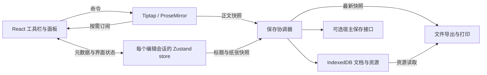

# Mewoc 首期实施方案

日期：2026-09-06。状态：已按本方案开始实现，当前工程与验收结果见 [编码记录](implementation-notes.md) 和 [使用说明](../README.md)。下文保留实施前的计划与验收门槛，历史“尚未验证”描述以 [M5 当前版本验收](m5-closure.md) 为准。

本方案承接 [Umo / React 技术调研](/Users/e7ic/Desktop/Zephyr/Labs/mewoc/docs/umo-react-research.md)，把已验证的技术组合收敛成开发范围、数据契约和验收门槛。

## 1. 已确定的约束与本方案的默认选择

用户明确要求：React 17、Tiptap 3、JavaScript / JSX、Zustand，可使用 pnpm；不编写 TypeScript / TSX。

以下是为了推进设计而采用的默认选择，不代表用户已经逐项确认：首期面向桌面浏览器、单人编辑、中文优先；先完成 Umo 开源版的核心编辑体验；默认在浏览器本地保存，同时预留宿主系统保存接口。纸张采用连续内容容器，提供手动分页符与浏览器打印。

首期完成的判断是：用户可以创建文档，编辑文字、表格和图片，刷新后恢复，导出带图片的文件，在新会话重新打开，并打印。工具栏能正确反映选区，失败状态可理解、可重试。

实时自动分页、DOCX 转换、AI、多人协作、批注、修订、版本历史安排为后续独立模块。如果实时自动分页成为硬要求，必须先完成分页原型，再确定正文与表格模型。Umo v5.0 起已移除自动分页，不能把它当作当前开源版的现成能力。[Umo 更新日志](https://dev.umodoc.com/cn/docs/editor/changelog)

## 2. 首期功能与实现归属

| 区域 | 首期交付 | 实现方向与明确边界 |
| --- | --- | --- |
| 文档栏 | 新建、打开本地文档、标题、保存状态、导出、打印 | 本地恢复默认开启；接入服务端后另显示同步状态 |
| 开始 | 撤销/重做、正文/H1–H3、加粗、斜体、下划线、删除线 | StarterKit；跨段落混合格式显示“混合”，不假装整段一致 |
| 文字 | 字体、字号、文字颜色、背景色、清除文字格式 | TextStyleKit；字体先用系统字体栈，不隐式下载公网字体 |
| 段落 | 左/中/右/两端对齐、行距、无序/有序列表、列表缩进 | TextAlign；自定义段落行距；普通段落首行缩进后续补齐 |
| 插入 | 链接、图片、表格、水平线、手动分页符 | 标准扩展为主，分页符为自定义节点 |
| 图片 | 本地选图、粘贴/拖入图片、等比缩放、替代文本、删除 | 本地资源存储与节点视图适配；裁剪、旋转、环绕排版后续补齐 |
| 表格 | 插入、增删行列、合并/拆分、表头、列宽调整 | TableKit；首期只承诺普通表格，不承诺跨页重复表头 |
| 布局 | A4、横/竖版、页边距、适应宽度、50%–150% 缩放 | 连续纸张容器；纸张设置持久化，缩放只属于界面偏好 |
| 导航 | 标题大纲、点击定位、字符统计 | 大纲从文档派生；标题位置随编辑更新，不长期缓存旧 position |
| 查找替换 | 普通文本查找、大小写选项、上下项、替换、全部替换 | 官方 FindAndReplace；首期不开放正则模式 |
| 文件 | Mewoc JSON 打开/导出、HTML 导出、纯文本导出 | JSON 包含资源；HTML 是静态输出；不承诺通用 HTML 无损往返 |
| 打印 | 打印 / 用户另存 PDF | 独立打印 DOM；等待字体和图片就绪，不显示虚构页数 |
| 基础体验 | 中文输入、快捷键、只读、加载/失败状态、键盘可达 | 真实输入法测试；只读也禁止粘贴、拖入和异步回调修改正文 |

文档栏下面采用“开始 / 插入 / 布局 / 视图”分组，左侧大纲可收起，中间是纸张，底部显示统计与缩放。React 组件和样式独立实现；当前不绑定整套 UI 库、路由或登录系统。

## 3. 依赖与扩展清单

### 已验证的工程基线

| 依赖 | 版本 / 决策 |
| --- | --- |
| react、react-dom | 17.0.2；ReactDOM.render 挂载 |
| @tiptap/react、@tiptap/core、@tiptap/pm | 3.31.3，精确同版 |
| zustand | 4.5.7；不采用要求 React 18 的 Zustand 5 React 绑定 |
| vite | 7.3.1，已在 Node 20.20.0 下完成最小构建验证 |
| pnpm | 11.19.0，正式工程固定 packageManager 并提交 pnpm-lock.yaml |
| 样式与语言 | .js / .jsx、CSS Modules、必要的编辑器内容全局样式、jsconfig.json |

这是一组已经试跑过的版本基线，不是“每项均为最新版本”的声明。正式工程仍需检查完整依赖树和构建工具配置。React 17 支持与 Zustand 版本选择有包元数据依据。[Tiptap React](https://registry.npmjs.org/@tiptap/react/3.31.3)、[Zustand 4](https://registry.npmjs.org/zustand/4.5.7)、[Zustand 5](https://registry.npmjs.org/zustand/5.0.15)

### 首期扩展注册

所有列出的 Tiptap 包均固定到 3.31.3；本轮补充核对了图片、文字样式、对齐、查找替换和 extensions 聚合包在该版本存在。新增包的完整组合尚未运行验收。

| 扩展 | 包 / 处理方式 |
| --- | --- |
| 基础文档、格式、列表、链接、撤销 | @tiptap/starter-kit |
| 字体、字号、颜色、背景色 | TextStyleKit，来自 @tiptap/extension-text-style |
| 对齐 | @tiptap/extension-text-align，限定 paragraph / heading |
| 表格 | TableKit，来自 @tiptap/extension-table |
| 图片 | 扩展 @tiptap/extension-image，补资源 ID 和本地资源解析 |
| 查找替换 | @tiptap/extension-find-and-replace |
| 占位提示、字符计数 | 从 @tiptap/extensions 选择对应扩展 |
| 段落行距 | 自定义 ParagraphSpacing，仅操作 paragraph / heading 的属性 |
| 手动分页符 | 自定义 PageBreak，具有 JSON 和静态 HTML 表达 |

注册时注意三个容易重复或误用的地方：

1. StarterKit 3 已包含 Link、Underline、UndoRedo；不要再重复注册。TableKit 已包含 Table、TableCell、TableHeader、TableRow。扩展名称必须唯一。
2. TextStyleKit 的 LineHeight 默认是 textStyle mark；3.31.3 的 setLineHeight 命令写入该 mark。我们的“段落行距”应关闭 kit 中的 lineHeight，另用块节点属性和命令实现，不能只更改 types 就假定命令语义随之改变。
3. 官方 Image 已提供 resize 选项和宽高属性，但只负责显示与调整，不处理上传或本地文件持久化。本地资源解析仍需自己的适配层；优先复用 ResizableNodeView，不要求每个节点都变成 React NodeView。

以上依据固定版本的已发布源码与官方说明：[StarterKit 发布包](https://registry.npmjs.org/@tiptap/starter-kit/3.31.3)、[文字样式包](https://registry.npmjs.org/@tiptap/extension-text-style/3.31.3)、[TextStyleKit](https://tiptap.dev/docs/editor/extensions/functionality/text-style-kit)、[Image](https://tiptap.dev/docs/editor/extensions/nodes/image)。

查找替换扩展当前是公开 npm 包，3.31.3 元数据标注 MIT。它能匹配跨不同文字格式的文本，但不会跨文本块或非文本内联节点。搜索结果与导航从扩展状态读取，UI 不另建第二份匹配结果。[包元数据](https://registry.npmjs.org/@tiptap/extension-find-and-replace/3.31.3)、[查找替换说明](https://tiptap.dev/docs/editor/extensions/functionality/find-and-replace)

## 4. 状态与组件边界



- Tiptap 拥有正文、选区、marks、节点属性及正文撤销历史。正文不放入 Zustand 做双向同步。
- Zustand 按编辑会话创建 store，保存标题、纸张、界面偏好、资源任务状态和保存进度；组件按 selector 订阅。
- 工具栏使用 useEditorState 派生格式、选区和命令可执行性；保存成功、主题改变不得重建编辑器。
- 保存协调器拥有计时器、快照、版本确认与取消逻辑；IndexedDB 和宿主接口不直接操作编辑器实例。
- 资源管理器持有 Blob 与临时 object URL；URL 生命周期与编辑会话绑定，不能写入持久化正文。

外部 API 采用非受控正文模式：初始文档只在创建会话时载入，后续编辑走 command；切换文档由宿主显式切换会话。不要设计成 onChange 全量传回 value，再在每次 React render 后 setContent。[Tiptap 性能指导](https://tiptap.dev/docs/guides/performance)

切换文档前先完成本地快照写入；失败时保留当前会话并显示恢复操作。新文档使用新的 editor 和 store，撤销不能回到上一份文档。Tiptap 3 的 setContent 默认会触发 update；emitUpdate: false 只抑制相应通知，不能据此认为历史已经重置。[setContent 文档](https://tiptap.dev/docs/editor/api/commands/content/set-content)

首期撤销覆盖正文及其中的图片尺寸、表格、文字和段落属性。标题、纸张和界面设置不合并到正文撤销；纸张设置弹窗采用“应用 / 取消”，在产品说明中明确这一边界。

建议目录按职责建立，实际实现时随功能增加，避免先生成大量空文件：

```text
src/
  main.jsx
  App.jsx
  editor/
    MewocEditor.jsx             编辑会话和生命周期
    EditorProvider.jsx          editor 引用与按实例创建的 store
    createEditorStore.js        元数据、界面和任务状态
    createExtensions.js         唯一扩展注册入口
    extensions/
      paragraphSpacing.js
      pageBreak.js
      documentImage.js
    components/
      DocumentBar.jsx
      Toolbar.jsx
      OutlinePanel.jsx
      SearchPanel.jsx
      PaperCanvas.jsx
      StatusBar.jsx
    document/
      schema.js                运行时验证、版本识别
      migrations.js            明确支持的历史版本迁移
      saveCoordinator.js
      localRepository.js       IndexedDB 事务与资源读取
      fileTransfer.js          文件打开与导出
      printDocument.js
    styles/
      editor.module.css
      content.css              编辑 / 预览 / 打印共享内容规则
      print.css
```

## 5. 文档格式与资源策略

持久化正文使用 Tiptap JSON，并包一层业务信息。下面是拟定的最小文档，不是已经发布的兼容协议：

```json
{
  "schemaVersion": 1,
  "id": "doc-example",
  "title": "未命名文档",
  "content": {
    "type": "doc",
    "content": [{ "type": "paragraph" }]
  },
  "page": {
    "size": "A4",
    "orientation": "portrait",
    "marginsMm": { "top": 20, "right": 20, "bottom": 20, "left": 20 }
  },
  "assets": [],
  "createdAt": "2026-09-06T00:00:00.000Z",
  "updatedAt": "2026-09-06T00:00:00.000Z"
}
```

字段规则：

- 纸张与页边距使用 mm；A4 基础尺寸 210 × 297 mm，方向改变时交换宽高。限制页边距之和必须小于对应纸张尺寸。
- 图片尺寸使用未缩放的 CSS px，保存 width / height；缩放比例是界面属性，不改变文档中图片尺寸。
- 字号保存带单位的 CSS 值，首期菜单使用 pt；段落行距保存无单位倍数。白名单验证属性值，不接受任意 CSS 文本。
- schemaVersion 用于内容结构兼容；编辑 revision 和存储版本放在保存记录中，二者不混用。
- assets 保存 ID、文件名、MIME 和大小等元数据；图片节点通过 assetId 引用。src 若保留，只允许稳定且经过校验的资源地址，不保存 blob: URL。

本地图片采用 IndexedDB Blob 存储。DocumentImage 节点视图解析 assetId 为临时 URL；打印和 HTML 导出通过独立序列化步骤解析资源，不能直接复制 React NodeView 的 DOM。编辑器 getHTML() 本身不等于已经具备可携带图片的完整文档导出。[Tiptap 持久化](https://tiptap.dev/docs/editor/core-concepts/persistence)、[React 节点视图](https://tiptap.dev/docs/editor/extensions/custom-extensions/node-views/react)

图片导入流程：校验文件 → 分配稳定 assetId 并展示处理状态 → 写入 Blob → 确认资源可读取 → 允许相关文档快照成为“已保存”。若先插入占位节点，异步结果按 assetId 找节点；节点已被删除、会话已切换或操作已取消时，不得重新插入图片。

删除图片时不立即删除 Blob，以免破坏撤销。首期可暂时保留未引用资源，后续增加基于已保存文档和会话引用的清理；导出仅包含当前快照引用的资源。磁盘配额不足时必须报错，不能仍显示已保存。

首期建议限制单张图片原始文件 5 MiB、单文档图片原始总量 20 MiB，支持 PNG / JPEG / WebP；这是待样例验证的产品限额，不是浏览器能力上限。拒绝超限文件时保留已有内容。先不提供外链图片插入入口；富文本粘贴中的外链图片不自动抓取，给出明确提示。

Mewoc 文件扩展名使用 .mewoc.json，携带如下外层信息：

```json
{
  "format": "mewoc",
  "formatVersion": 1,
  "document": { "schemaVersion": 1 },
  "assetData": {}
}
```

这里 document 实际放入完整文档，assetData 是 assetId 到 data URL 的映射；示例为结构示意，不能直接作为完整文档导入。导出时才编码 Blob，编辑过程中不反复生成 base64。新会话导入时校验并还原 Blob，默认生成新的文档 ID，避免覆盖已有本地文档。便携文件会比原始二进制更大；大附件或批量文档需求出现后，再评估 ZIP 容器。

导入分两层验证：先验证文件结构、大小、资源类型与引用完整性，再验证节点、mark、属性白名单和 ProseMirror schema。未知节点、缺失图片、未来 schemaVersion 必须报告具体路径并停止载入；首期不静默丢弃内容，也不宣称可直接打开任意 Umo JSON。

HTML 导出包含基础样式和嵌入图片；纯文本导出丢弃格式；两者不替代可编辑的 Mewoc 文件。粘贴 HTML 先做允许内容及链接协议过滤，再交给 schema 转换，不能把 schema 检查当成完整的内容清理。

## 6. 保存、恢复与失败契约

默认保存目标为本机 IndexedDB，状态文案明确“已保存到此浏览器”。只有实际配置并成功调用宿主接口时，才显示“已同步到服务器”。本地副本会受浏览器存储清理影响，文件导出是独立备份方式。

保存记录分别维护：当前会话 ID、当前编辑 revision、localSavedRevision，以及可选的 remoteSavedRevision / remoteVersion。正文、标题或纸张改变都增加编辑 revision；光标、选区、主题和缩放不增加。

拟定调度策略是输入停顿 800 ms 后保存本地快照，并设置最长约 5 s 的等待上限；这是实现目标，不能保证浏览器挂起或突然退出前最后一笔输入落盘。composition 结束后刷新待保存状态；不能在输入法组合输入时反复 setContent、重建节点或抢焦点。导出和手动保存必须先捕获最新快照，不能依赖上一次定时保存。

保存执行规则：

1. 捕获快照及其 documentId / sessionId / revision；确保引用资源已经可持久化，文档记录写入完成后再确认本地保存状态。
2. 同一文档的写入串行执行，可合并尚未开始的快照。revision 8 成功后若用户已编辑到 9，状态仍是有待保存内容。
3. 本地记录使用独立 storageVersion，在同一个 IndexedDB 读写事务中比较再更新。另一个标签页已经写入时报告冲突，不能无提示覆盖。
4. 宿主保存同样串行，并携带 baseVersion。服务端必须比较版本并返回新版本，才具备防止多端覆盖的能力；只有一个普通 POST 回调并不足够。
5. 失败保留当前内容和错误信息，提供重试、另存文件。切换会话后忽略旧会话的迟到响应，AbortSignal 只辅助取消，不能视为服务端一定没写入。

可选宿主接口先固定语义，具体传输库由接入项目决定：

```js
saveDocument({ document, baseVersion, clientRevision, signal })
// Promise -> { id, version, updatedAt }

uploadAsset({ documentId, assetId, file, signal })
// Promise -> { assetId, url }
```

saveDocument 收到的是不可变快照；返回的 id 必须匹配请求文档。启用远端资源时，相关图片先上传成功，再保存引用；URL 必须是持久地址或服务端可解析的资源标识，不能把短期签名地址当永久内容。没有宿主配置时，本地编辑、恢复和文件导出仍须独立完成。首期不臆造后端地址，也不把模拟返回值标成真实保存。

另存文件不以本地写入成功为前提：即使 IndexedDB 配额不足，也应尝试从最新正文及仍在内存中的 Blob 导出恢复文件；只有资源确实无法取得时才报告缺失，并保留可恢复的原始内容。

## 7. 编辑与打印的关键约束

- 工具栏按钮有可访问名称、按下状态与禁用状态。执行命令前保持有效选区；弹窗打开时记录 selection bookmark，期间文档有事务时进行映射，确认后再执行。不能永久保存裸 from / to。
- 行距变更只覆盖选区涉及的段落/标题，一次操作形成可撤销事务。列表内段落同样处理，不能把列表容器改成文字 mark。
- 图片拖动缩放与表格列宽必须分别在 50%、100%、150% 页面缩放下验证。屏幕指针增量与未缩放文档尺寸属于不同坐标；官方缩放组件仍需验证坐标适配。
- 首期图片是块节点，显示宽度受内容区约束；改变纸张方向或页边距后不能让图片操作柄不可达。复杂表格在编辑中可横向滚动，打印超宽表格时给出调整建议，不能静默裁剪后宣称完整输出。
- 大纲和计数由文档派生，不因 selectionUpdate 重扫正文。首期显示“字符数（不含空白）”，按 Unicode 码点计数，并明确换行/空格不计入；不把它叫作准确的中文词数。
- 手动分页符作为文档节点保存，打印时应用 break-before。连续纸张视图不显示没有排版依据的总页数。
- 打印使用最新快照生成静态文档，等待字体与图片加载完成后调用 print；加载失败时提示并允许重试。去除工具栏、选区、缩放 transform 和缩放手柄。
- 打印 CSS 与编辑内容共享字体和段落样式。浏览器纸张设置仍会影响最终结果；按钮名称使用“打印 / 另存 PDF”，不承诺静默 PDF 下载或与 Word 完全一致。

## 8. 实施顺序与退出条件

每个里程碑都以实际行为通过为准，不以组件数量或工具栏外观作为完成标准。

| 里程碑 | 工作内容 | 进入下一步的条件 |
| --- | --- | --- |
| M0：兼容性门槛 | 初始化 JS/JSX 工程；复现已有最小验证；补中文输入、销毁重挂、双实例、缩放下图片/表格操作 | 不丢组合输入，不出现双编辑器、重复扩展或实例串状态；缩放坐标问题已有处理方式 |
| M1：文字编辑闭环 | 文档会话、工具栏、格式、段落、列表、链接、纸张容器 | 混合选区状态正确；撤销/重做与快捷键正确；只读不可写 |
| M2：可靠保存 | 文档模型、运行时校验、IndexedDB、保存协调器、文件打开/导出 | 刷新恢复；乱序响应、失败重试与双标签页冲突有确定行为 |
| M3：图片与表格 | Blob 资源、图片视图、尺寸、表格命令与列宽 | 图片跨会话可恢复；缩放后尺寸往返；插入/删除/撤销不丢资源 |
| M4：导航与输出 | 大纲、计数、查找替换、手动分页符、HTML/文本导出、打印 | 搜索状态随编辑更新；便携文件在空存储中还原；打印无界面控件 |
| M5：首期验收 | 真实输入法、浏览器样例、长文档、错误路径、依赖与许可清单 | 下表关键场景全部通过；已知边界写入使用说明 |

已有临时实验只完成 M0 的一部分：React 17、React NodeView、命令、撤销重做、JSON 回填、表格插入、useEditorState、Zustand 与只读订阅共 10 项通过，且 Vite 构建通过。当前没有首期应用代码；完整扩展组合、中文输入法、缩放、图片存储和保存冲突均未完成运行验证。

## 9. 首期验收样例

| 样例 | 必须观察到的结果 |
| --- | --- |
| 中文与中英文混排 | 实际拼音输入法候选确认、回删、连续输入正常；合成事件或粘贴不能代替真实 IME 验证 |
| 格式与跨块选区 | 跨段落/列表/表格选择、修改格式、撤销/重做后内容和光标合理 |
| 图片生命周期 | 导入、删除、撤销、刷新、文件导出再导入均不丢图；删除后的异步结果不复活节点 |
| 图片与表格缩放 | 50% / 100% / 150% 下拖动方向和幅度正确；保存再载入宽高一致 |
| 保存期间继续输入 | 旧快照写入成功不把新编辑标成已保存；最终恢复的是最新成功快照 |
| 失败与切换 | 存储写入失败保留当前会话；切换 A → B 后 A 的迟到响应不修改 B 的内容或状态 |
| 双标签页 | 第二个会话保存基于过期版本时显示冲突，不无提示覆盖先前提交 |
| 多实例与只读 | 同页两个实例的内容、工具栏和状态独立；只读没有延迟异步写入 |
| 导入校验 | 未知节点、缺失资源、超限图片和未来版本给出可定位错误，原文档保持完整 |
| 查找替换 | 中文、不同格式包裹的同一句文字、跨段落边界、替换后匹配数变化均符合规则；全部替换可撤销 |
| 文件与打印 | 空存储的新会话可打开带图片文件；HTML 可独立查看；手动分页、横版和边距可在打印预览核对 |
| 长文档 | 1 万字常规文档作为首期验收基线；10 万字、20 张图、100 × 10 表格分别作为压力样例并记录限制 |

浏览器先验收桌面 Chrome / Edge，再补 Safari 的输入、选择和打印关键流程；实际版本与设备配置随测试记录保存。性能记录输入延迟、事务处理、序列化和滚动，不拿临时 demo 的包体积充当产品性能证明。不能把多个压力上限未经测试直接组合成支持承诺。

自动化优先覆盖保存版本确认、资源往返、导入校验和自定义节点序列化；人工覆盖真实 IME、选区拖拽、焦点、缩放与打印。当前文档列出的是待执行验收，不是已通过测试清单。

## 10. 后续模块的接入顺序

首期稳定后，先补格式刷、段落缩进、主题、公式、代码高亮、Markdown 与附件，再按实际需求投入 DOCX、AI、分页或协作。重型功能按需加载；每项新增节点同时交付序列化、文件格式兼容和资源处理。

多人协作将改变正文持久化与撤销机制，不能简单在现有自动保存之上再接一条 WebSocket。页眉页脚、自动页码和跨页表格则属于分页/打印专项。Tiptap Pages 当前属于商业能力，其专用表格及排版限制需要另做原型。[Pages 概览](https://tiptap.dev/docs/pages/getting-started/overview)、[Pages 限制](https://tiptap.dev/docs/pages/core-concepts/limitations)

代码复用采取逐文件记录：如果实际移植 Umo 的 MIT 代码，登记来源提交、保留版权和许可；不复制 Umo Next 商业代码。Umo 官方 UI 署名要求与标准 LICENSE 文本的差异，沿用调研报告中的区分，本方案不新增去标授权结论。[Umo LICENSE](https://github.com/umodoc/editor/blob/baa1d0e9eb99b4ce116d9a894fe538e4d2917e1f/LICENSE)

下一次进入实现时，从 M0 的工程和真实交互验证开始，随后完成 M1–M2 的文字编辑与保存闭环。
